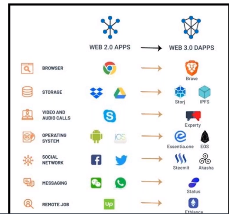
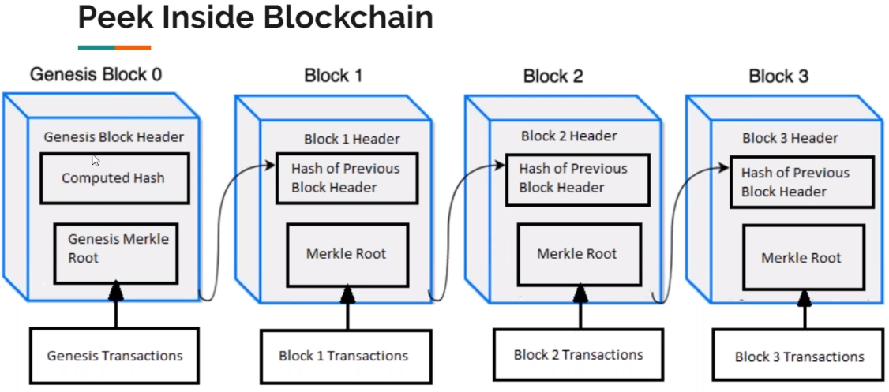
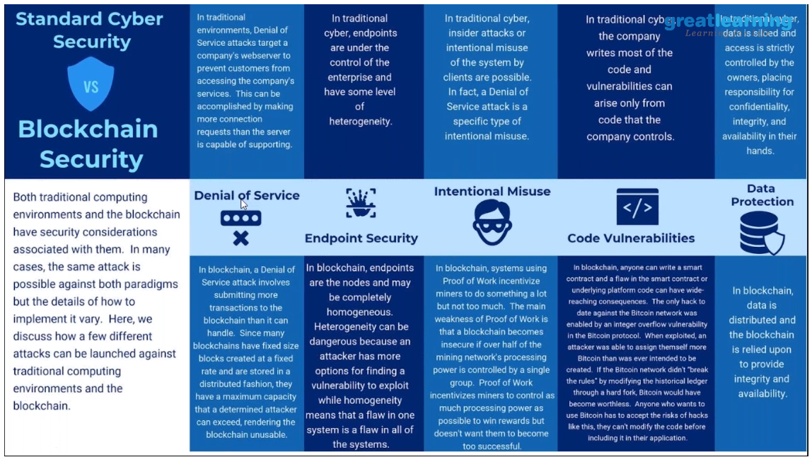

# What is BlockChain?

- A blockchain is a digitized, distributed, consensis-based secure storage of information protected from revision and tampering over the peer-to-peer network.

- Blockchain is the tech. Bitcoin is merely the first mainstream manifestation of its potential.

  > Blockchain is a digitized, distributed ledger for all the records.

  > It is a digitized for information in the form of transactions.

  > Its is distributed. Thus no body controls it.

  > Consensus algorithms make sure of the security and immutability.

  > When a new block is added to a blockchain. it is linked to the previous block using a cryptographic hash.

  > Data gets recorded in chronological order.

  > Everyone present over the network can view the transactions.

  > A distrubuted database recording transaction in chronological order.

  > Devised initially to power Bitcoin.

# Blockchains are built from 3 technologies.

1. Private key cryptography - ECC / RSA
2. P2P network - Torrent Network / System of Records
3. Program( the blockchain protocol) - Hashing Algo / Handshake Algo

# Blockchain Analogies to Real World

    - Transparent Bank Vaults.
        * Imagine a massive vault system from a bank.
        * The vault is filled with rows of deposit boxes.
        * Each deposit box is made up of glass, allowing everyone to see the contents of the deposite box, but only have access to their vault.
        * When a person opens a new deposit box, he/she get a key that is unique to that box.
        * This is the fundamental concept of cryptocurrencies based in Blockchain.
        *** Any one can see the contents of all other addresses.
    - Bank account statements.
    - A spreadsheet which is duplicated hundreds of times across the network of computers.
    - A large size notebook distributed across all the readers.
    - A google doc shared between multiple parties.
    - A street soccer game.

# Why BlockChain is Web 3.0?

    - No Central point of control.
    - Ownership of Data.
    - Reduction in Hacks and Data Breaches.
    - Uninterrupted Service

# Blockchain Characteristics

    - Each block is built on top of the previous block and uses the block's hash to form a chian.
    - Validating and confirming blocks over the chain is handled by miners.
    - Blocks created are cryptographically sealed over the Blockchain, which means that it is nearly impossible to delete and modify data over the Blockchain.
    - Consensus algorithms make sure that all the trasactions are validated and only added once over the Blockchain.
    - Miner receives a reward for running the consensus algorithms; the current reward is 12.5 BTC is case of Bitcoin Blockchain and 2 ETH in case of Ethereum Blockchain.
    - All the Blocks added are in chronological order and time-stamped.

# Built in Security for Cyber Security

    - Protected edge computing with authentication.
    - Advanced confidentially and data integrity.
    - Secure private messaging.
    - Improved public key infrastructure.
    - Intact Domain Name System ( DNS).
    - Diminished DDos attacks.
    - Blockchain doesn't require passwords as it relies either on private keys as well as multiple setps for authentication, to ensure that users are who they say ther are. These systems provide more effective protection to our information than usernames and password etc.

