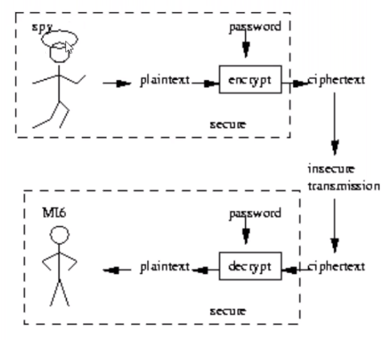
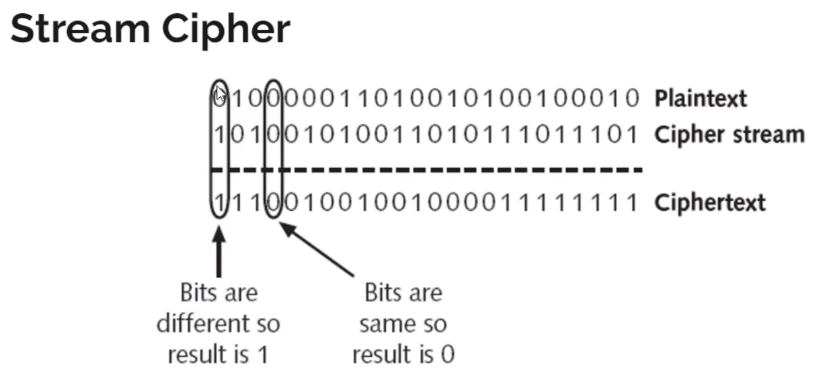
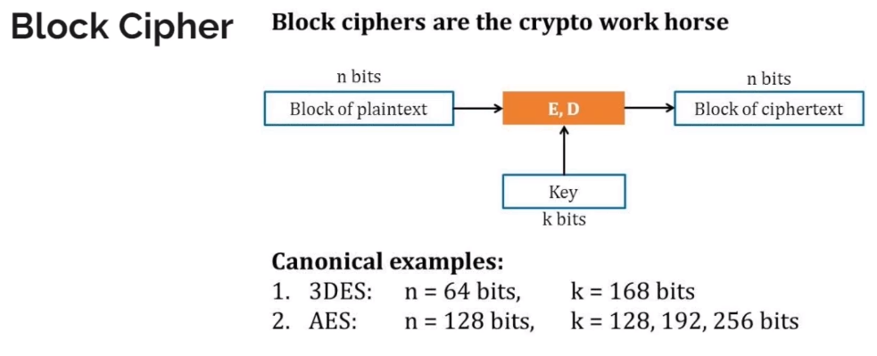

# What is Cryptography?

- Cryptography is a technique to hide the information. encrypt
- Cryptography is an important aspect when we deal with network security.
- 'Crypto' means secret or hidden.
  

# Types of Cryptography.

> Symmetric / Private Key Cryptography

    - Both 1st and 2nd person have the private key to encrypt and decrypt the message to send and receive.

- Stream Cipher
  
- Block Cipher - recommended
  

> Asymmetric / Public Key Cryptography

    - 1st person have its own private and public key and also 2nd person's public key and same to the 2nd person.
    When 1st person sent message using 2nd person's public key, the 2nd person decrypt the message using its own private key and vice-versa.

- Key Pair -> Private Key, Public Key
  - Algorithm:
    - RSA - repalced by ECC - 2048
    - ECC - new recommended - 256 - faster

> Both Summetric and Asymmetric Cryptography.

    - Speed problem solve - First symmetric key is passed using 2nd person public key and, 2nd person receive the symmetric key and then the conversation can be carried out using just symmetric key.

    - public key problem - We use 3rd party (CA - Certificate Authorities) .
    Trusted 3rd party. The public key is provied with certificate to 2nd person.

# Types of Encryption.

- Caesar Cipher
- DES - Data Encryption Standard - 56 bit
- 3XDES - 56\*3
- AES - 128 bit , 196 bit , 256 bit
