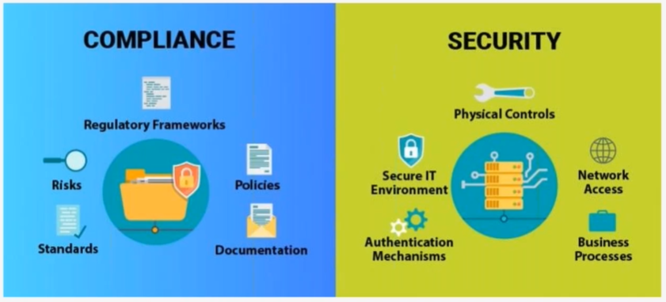
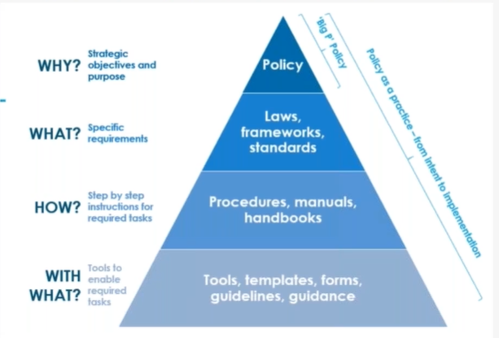
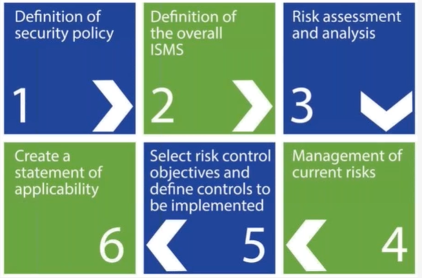
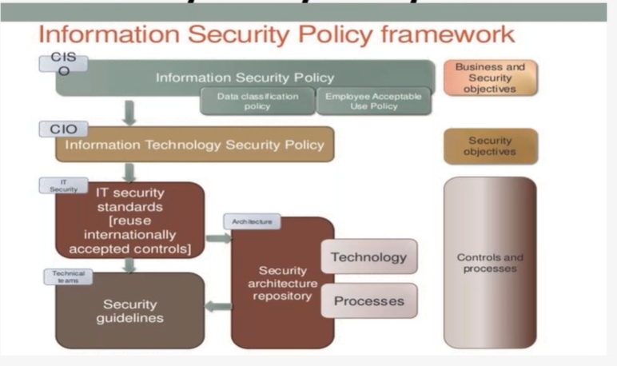
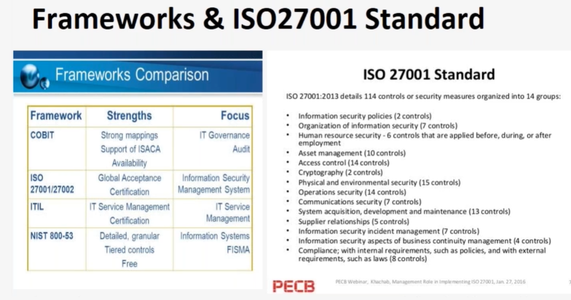
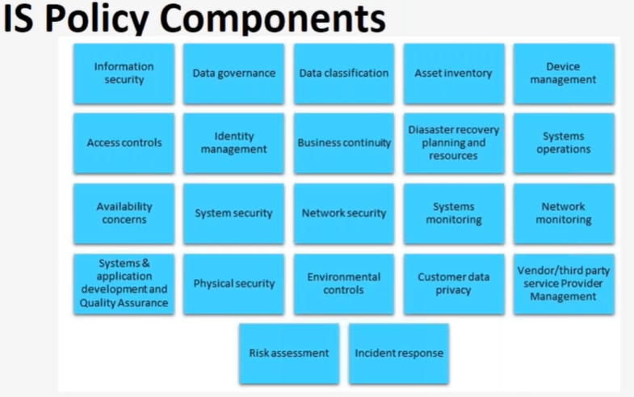

# Cyber Security Landscape, Strategy

# Cyber Security Policy Management

- What Elements are included in company's CyberSecurity Policy?

  - Required SEcurity Software - 84%
  - How Data is backup - 81%
  - How to Detect Scams, Like Email Phishing - 79%
  - How to Report Security Incidents - 78%
  - Requirements for Regularity Updating Company Computers - 75%
  - What Password Management System to use - 72%
  - Content Sharing - 67%
  - Internet Usage - 67%
  - Network Access - 63%
  - Device Usage - 63%

  # Cyber Security Policy Ecosystem

  

# Standards & Guidelines

# ISO 27001 Standard

- An ISMS standard replaced BS77799-2:2002 in late 2005.
- The world's only cyber security standard.
- Formally specifies an ISMS that is intended to bring information security inder explicit management control.
- Best practice specification that helps businesses and organizations throughout the world develop a best-in-class ISMS.
- Adopts the Plan-Do-Check-Act(PDCA) model.

> Main ISMS Conpoents

    - Management Responsibily
    - Awareness,Traning and Communication
    - ISMS Policy
    - Asset Inventory
    - Risk-based Approach
    - Measures, Implementation
    - Continuous Improvement
    - Audits & Management Reviews

