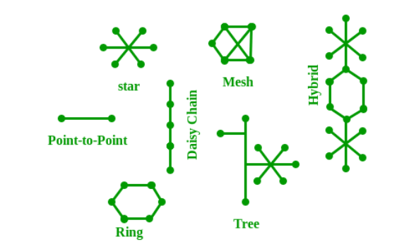
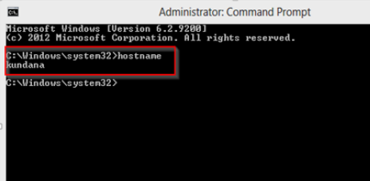
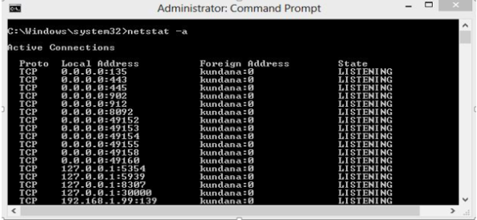

# Basics of Computer Networking

- ## Open system:

  - A system which is connected to the network and is ready for communication.

- ## Closed system:

  - A system which is not connected to the network and can’t be communicated with.

- ## Computer Network:

  - An interconnection of multiple devices, also known as hosts, that are connected using multiple paths for the purpose of sending/receiving data or media. Computer networks can also include multiple devices/mediums which help in the communication between two different devices; these are known as Network devices and include things such as routers, switches, hubs, and bridges.

  > 

- ## Network Topology:

  - The layout arrangement of the different devices in a network. Common examples include: Bus, Star, Mesh, Ring, and Daisy chain.

  > 

- ## OSI:

  - OSI stands for Open Systems Interconnection. It is a reference model that specifies standards for communications protocols and also the functionalities of each layer.

- ## Protocol:
  - A protocol is the set of rules or algorithms which define the way how two entities can communicate across the network and there exists different protocol defined at each layer of the OSI model. Few of such protocols are TCP, IP, UDP, ARP, DHCP, FTP and so on.

# UNIQUE IDENTIFIERS OF NETWORK

- ## Host name:

  - Each device in the network is associated with a unique device name known as Hostname.
    Type “hostname” in the command prompt(Administrator Mode) and press ‘Enter’, this displays the hostname of your machine. > 

- ## IP Address (Internet Protocol address):

      - Also known as the Logical Address, the IP Address is the network address of the system across the network.

  To identify each device in the world-wide-web, the Internet Assigned Numbers Authority (IANA) assigns an IPV4 (Version 4) address as a unique identifier to each device on the Internet.
  The length of an IPv4 address is 32-bits, hence, we have 232 IP addresses available. The length of an IPv6 address is 128-bits.
  Type “ipconfig” in the command prompt and press ‘Enter’, this gives us the IP address of the device.

- ## MAC Address (Media Access Control address):

      - Also known as physical address, the MAC Address is the unique identifier of each host and is associated with its NIC (Network Interface Card).

  A MAC address is assigned to the NIC at the time of manufacturing.
  The length of the MAC address is : 12-nibble/ 6 bytes/ 48 bits
  Type “ipconfig/all” in the command prompt and press ‘Enter’, this gives us the MAC address.

- ## Port:

      - A port can be referred to as a logical channel through which data can be sent/received to an application. Any host may have multiple applications running, and each of these applications is identified using the port number on which they are running.

  A port number is a 16-bit integer, hence, we have 216 ports available which are categorized as shown below:

  |       PORT TYPES |         RANGE |
  | ---------------: | ------------: |
  | Well known Ports |      0 – 1023 |
  | Registered Ports |  1024 – 49151 |
  |  Ephemeral Ports | 49152 – 65535 |

  Number of ports: 65,536
  Range: 0 – 65535
  Type “netstat -a” in the command prompt and press ‘Enter’, this lists all the ports being used.

  > 

- ## Socket:

  - The unique combination of IP address and Port number together are termed as Socket.

- ## DNS Server:

      -DNS stands for Domain Name system.

  DNS is basically a server which translates web addresses or URLs (ex: www.google.com) into their corresponding IP addresses. We don’t have to remember all the IP addresses of each and every website.
  The command ‘nslookup’ gives you the IP address of the domain you are looking for. This also provides the information of our DNS Server.

- ## ARP:

  - ARP stands for Address Resolution Protocol.

  It is used to convert an IP address to its corresponding physical address(i.e., MAC Address).
  ARP is used by the Data Link Layer to identify the MAC address of the Receiver’s machine.

- ## RARP:
  - RARP stands for Reverse Address Resolution Protocol.
    As the name suggests, it provides the IP address of the device given a physical address as input. But RARP has become obsolete since the time DHCP has come into the picture.
