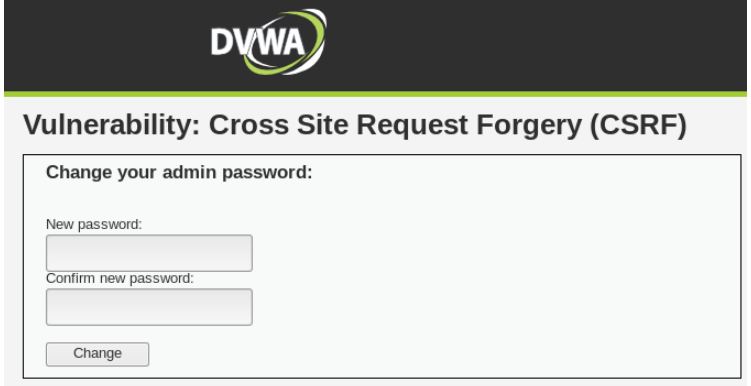
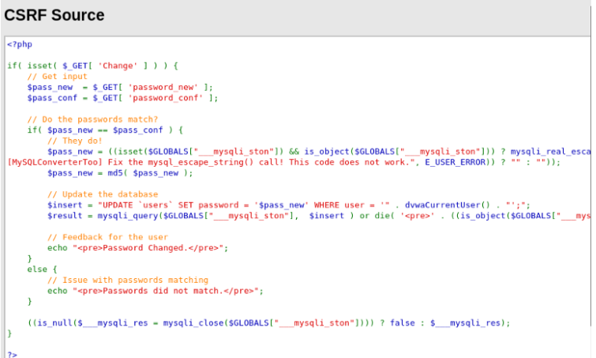
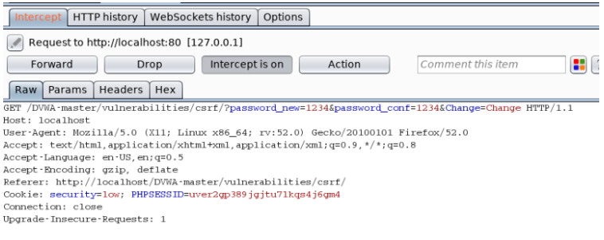
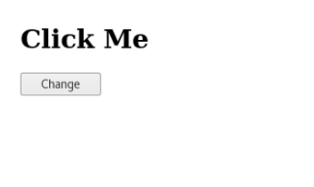
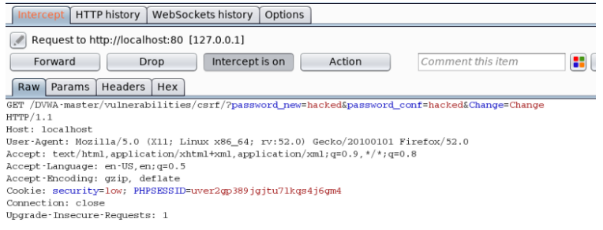

# CSRF (Low-Security)

> 

- This walkthrough explains how to bypass the low security level for CSRF (Cross Site Request Forgery) in the DVWA (Damn Vulnerable Web Application).
- Cross-Site Request Forgery (CSRF) is an attack that forces an end user to execute unwanted actions on a web application in which they’re currently authenticated. This can result in changing e-mail addresses or stealing money. In this scenario we will be changing the users password.
- Lets get straight into it. The first thing I did was to check the source code. You can simply do this in DVWA by clicking view source in the bottom right.

> 

- Ok thats simple enough, the script takes the user input and checks if the two passwords match, if they do the password is updated, if not the password is not updated. What we can see here is there is no protection against CSRF, such as Anti-CSRF token.
- Lets open up Burp Suite and see what happens when we try to send a legitimate request from inside DVWA.

> 

- What I did was change the password from inside the DVWA and then intercepted the request using Burp. This way we can have a in depth look at the request. What we can see is it is a GET request and you can see the value of the new password has been changed to 1234 (super secure). You can also see the session ID of the user in the cookies.
- The next step is to view the html source code of the page. There is a form in there that makes a GET request. It looks just like this.

            <form action=”#” method=”GET”>
            New password: 
            <input type=”password” AUTOCOMPLETE=”off” name=”password_new”> 
            Confirm new password: 
            <input type=”password” AUTOCOMPLETE=”off” name=”password_conf”> 
             
            <input type=”submit” value=”Change” name=”Change”>
            </form>

- It is the form that you see when you change the password; it takes the input from the user for a new password and confirm password. I took this snippet of code and placed it in a html file. I made a few changes as you can see below.

            <form action=”http://localhost/DVWA-master/vulnerabilities/csrf/?" method=”GET”>
            <h1>Click Me</h1>
            <input type=”hidden” AUTOCOMPLETE=”off” name=”password_new” value=”hacked”>
            <input type=”hidden” AUTOCOMPLETE=”off” name=”password_conf” value=”hacked”>
            <input type=”submit” value=”Change” name=”Change”>
            </form>

- As you can see, I make a GET request to http://localhost/DVWA-master/vulnerabilities/csrf/?. I created a header that says “Click Me” and hide those password input forms, but I have already predefined the values with the new password in them, “hacked”. All the user sees on the page is the header and the button. Lets have look.
  > 
- Once the user clicks the button “Change” a request will be sent to change the users password. Let’s see that in Burp.
  > 
- The request has been captured in Burp and what we can see is a GET request has been made to change the password. Look at that session ID in the Cookie. Look familiar? It is the same session ID from when we made the legitimate request. The request comes from the same browser the user is already authenticated to DVWA on so therefore the request is allowed.
- This scenario isn't very sophisticated, it displays how the attack would be carried out. A real life scenario may involve some social engineering where a phishing email is sent and the user is redirected to a web page, revealing a page that looks legitimate to the user. Unknown to them, someone could be stealing their session. A successful CSRF attack can force the user to perform state changing requests like transferring funds or changing passwords. One way to protect against this type of attack is to use a Anti-CSRF token. This is a huge random string, impossible/impractical to guess and brute force. Whenever the user makes some request this token will need to be verified.
