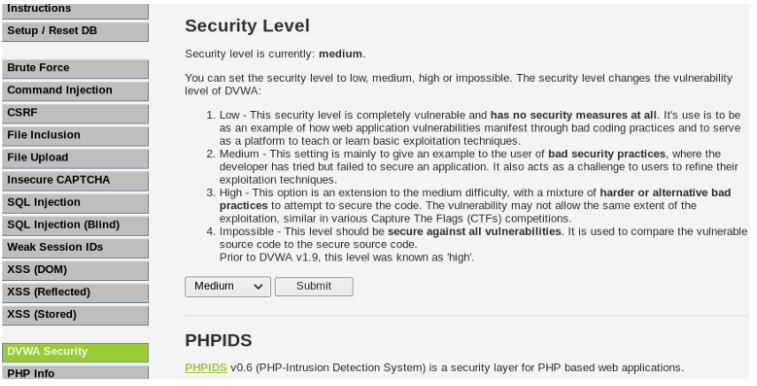
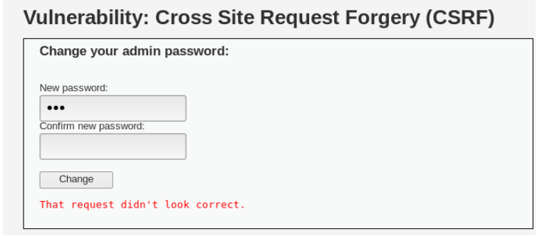
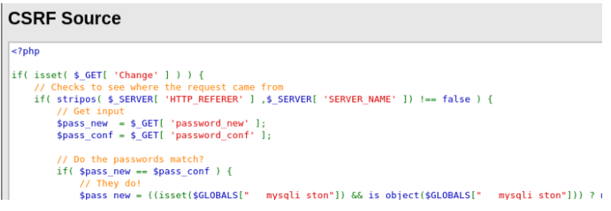
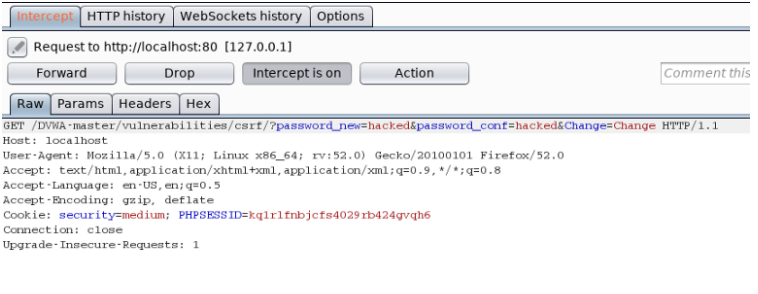
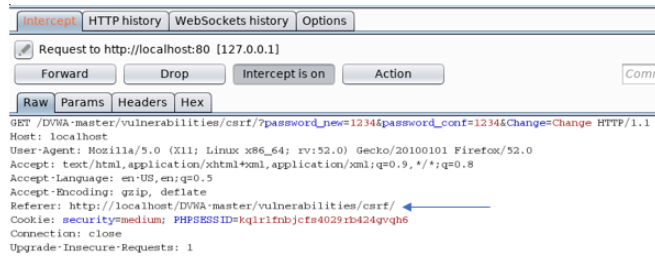
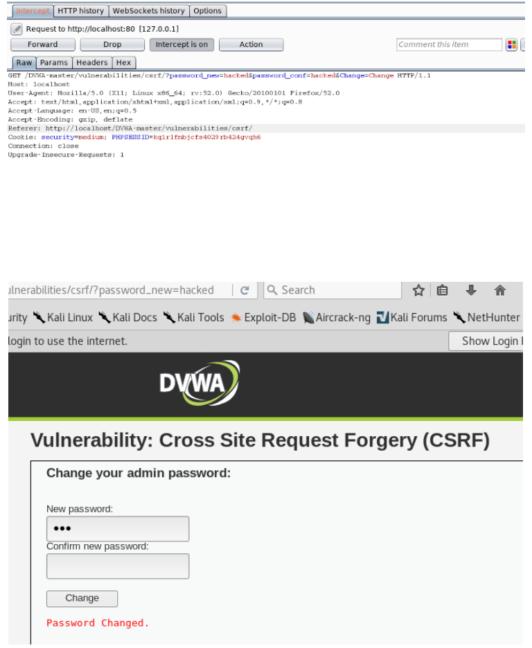

# CSRF (Medium-Security)

- This walk-through describes how to bypass the medium level security in the DVWA (Damn Vulnerable Web Application).
- First things first, lets change the security level of the DVWA.
  > 
- So, lets try what we did last time and see what happens.
  > 
- If you remember what we did last time, we created a spoof html page, that contained a header and a link, but unknown to the authenticated user we had some hidden data in that html page. We had the html form to change the password and had already pre-set the value for the new password. This resulted in the password being changed when the user clicks the link.
- Trying the same request results in a “request not allowed message”, therefore this will not work on the medium difficulty. A security check has been added before the password change action can be performed.
- Lets look at the source code.
  > 
- See that? That looks new. Whats happening is there is now a check to see where the request comes from. It is checking if the HTTP referer is in the server name and vice-versa. If yes the request goes ahead.
- A HTTP Referrer is a HTTP header field that identifies the address of the webpage (i.e. the URI or IRI) that linked to the resource being requested. By checking the referrer, the new webpage can see where the request originated.
- Ok so how do we get around this, lets take a look at this in Burp Suite. First I am going to intercept the request that comes from the illegitimate source, remember this didn't work ealier.
  > 
- This is what the request looks like in Burp when we intercept it. Lets take a look at what it looks like when it comes from within the DVWA.
  > 
- Can you see the difference? Within the legitimate request we see there is a Referer, where the request came from. That matches up so the request goes ahead.
- So what if we intercept the illegitimate request with Burp and add the HTTP Referer. Like so.
  > 
- ## It works! password changed and if you look in the URL, you can see the new password.
