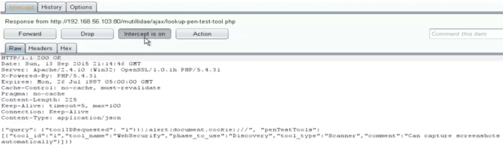

## Let me start my defining injection and why it happens. Attacker’s enter malicious payload that can trick the interpreter into executing unintended commands or accessing unauthorised data. Injection flaws occur due to the sole reason that untrusted data is sent directly to an interpreter as a part of a command or query without the payload being checked or sanitised causing all the problems.

# 1. SQL Injection

- This type of attack mostly take place when the attacker inserts a tick (‘) at the end of the statement add OR to the statement following by a truth totality. In simple words the SQL payload looks something like this.

  > ’ or 1 = 1 --

  - The above statement when added to a query can help attackers obtain access to complete databases. To give you a better understanding look at the below query which will provide the attacker with the entire database.
    > SELECT \* FROM Users WHERE UserName = 'Aditya' OR 1=1--
  - Have a look at the code below and try to figure out if it is vulnerable to SQL injection or not.
    > 
  - The reason the code is not secure is because the value that is entered by the attacker is directly being passed as an argument. Things are fine as long as the expected values are being entered but the input from the user might contain %1$tm, %1$te & %1\$tY format specifiers.
  - If the attacker passes in the value %1\$tm for the args[0], the result will be following.
    > 05 did not match! Hint: It was issued on the 23rd of some month.

  > // 05 is the month that the user needs to know to verify himself.

  - You can see that the program itself will spew out the month of the credit card expiration date.
  - To avoid such an attack a code like the one below can be extremely helpful.

    > 

    > The only difference between the two codes here is that in the first code the value entered by the attacker was directly passed into the program whereas in the second code instead of passing the value we printed it out straight away rendering the whole attack useless.

    > Prevention against SQL Injection attacks should involve input validation. We must check the value that has been entered by the user and we must always assume these values to be untrusted i.e. they can harm the application.

    > We must use parametrised queries with bind variables and carry out sanitisation for the values that are being entered by the user.

# 2. Command Injection

- This one of the most dangerous type of injection attack that is still prevalent in the present day scenario and isn’t given that much of attention. This attack takes advantage of vulnerability where the attacker can enter and execute commands that are not expected by the application.
- Let me share one example with you to show a basic implementation of command injection attack.
  > 
- In the above image we observe that there is a text box where we need to enter the Hostname / IP and the details regarding the IP address will be fetched and then presented to us.
- The whole application seems pretty straight forward but it is vulnerable to code injection. To understand that we need to figure out first of all how does the app works and then we can try to figure out then we can understand how the code injection works.
- When we enter the Hostname/IP then the app actually makes a a call to the terminal and the output is then displayed to us from there onwards. Those who have worked with the terminal they know this that we can use && in the terminal to pass two different commands at the same time.
  > 
- Thus the above image shows exactly how a code injection might work. To avoid such attack the app needs to perform path validation ( canonicalise then carry absolute path check ) the application also needs to perform input validation as well enumerating the commands it allows the user to input and execute.
  > enum { dir, cd, cls }

# 3. JSON Injection

- This is an important injection attack and the one that is on a rise seeing the frequent use of APIs in application these days. JSON injection works when we inject our payload in the JSON query that is being passed on while the API makes request and response queries.
  > 
- This example is a simple one to understand, this application has a drop down menu from where you need to select an option which is a PenTest tool and the application will present you with the details of the PenTest tool you select.
- So, let us try to understand how this application works. Let us turn on burp-suite and intercept the request the application makes.
  > 
- So, in the above image we can see that the ToolId is being sent over in the request query, we add our payload to the ToolId just to check if it is being reflected to us in the response query.
  > 
- We do receive the payload back the one that we injected in the request query and so we can make sure that our injection attacks will go through. Let’s carry out the attack payload and confirm if the attacks work sor sure.
- Seeing the response that we received earlier, let us pass this value to obtain the cookie value.
  > “}});alert(document.cookie);//
- Before passing in the value as it is in the parameter we url-encode it to avoid any special character restrictions that might have been placed.
  > 
- We can clearly see that the cookie value has been returned to us in the alert box and it confirms that the attack has gone through.
  > 
- We need to check how the attack actually look like in the browser and it the cookie details have been displayed as desired.
  > 
- The most effective way to prevent against the JSON injection attack is to carry out the encoding technique on the JavaScript. OWASP also presents a JSON sanitiser that can be used for string validation purpose.
  > String someValidation = JsonSanitizer.sanitize(myJsonString);

# Moral

1. The most important thing we can do to prevent injection attacks from taking place is to believe that any and all input from the user side can be an attack. Programmers mostly take it for granted that the input made by the user will not be harmful for the application that is what causes most of the vulnerability in the application. Each and every input from the use side must be sanitised and the input must be validated before being utilised by the application. The value entered by the user must never be passed directly into the program.
2. If the programmers keep these few things in mind they can surely defend against majority if the injection attacks.
