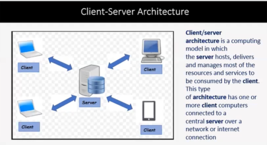

# Client State Manipulation

- Once the code is delivered to the client side. Client suppose to respond back to the server in case if genuine. THe code can be modified before responding by malicious intent user.

  > 

  - ## What is Client State?

    - Remembering who your are and what information you have been using to communicate with the server.

  - ## How can you alter the Client state?

    - Suppose server sent the html,css,file to load a webpage, a client place a order. If the calculating code in the client side then calculation can be altered, modifiying, the total amount 2000 to 20. and if the server dont validate the data, then the client state is altered.

  - ## How to stop the Client State Manipulation Attack?

    - Instead of doing calculation part in client-side, do the calculation in server-side.
    - Using of session id to distinguish the users. session id timeout must be use.
    - Using session id, the server can track the client , if the man in the middle attack is occur or the session have been hijack then the server will know the client is hijack and drop the session.
    - Using HTTPS
    - Useing POST method to sent data to server.

- ## Cookies and Javascript

# SQL Injection

- It's an attack used by hackers specially web application penetration testers by sending malicious SQL queries to the database vai application.

  > 

  > 

  - ## Types of SQL injection.

    - Bypass Authentication Injection.
    - Union based injection aka Advance SQL.
    - ERROR BASED SQL injection.
    - Blind SQL injection.
    - Serach in google

  - ## How to prevent SQL injection.
    - Black Listing
    - White Listing
    - Prepared Statements
    - Hardening BD and OS
    - Serach in google

# Password Security

- ## Securing Password Technique:-

  - Hashing
  - Salting

- ## Password based Attacks:-

  - Offline dictionary attack
  - Online dictionary attack
  - BruteForce attack

- ## Additional Password Securing Technique:-
  - Filtering -> filtering the eazy password. recommend strong or unpredictable password
  - Strong Password
  - HoneyPots -> Dummy account, if someone login then the system is compromized. eg admin admin
  - One Time Password , otp , 2nd authentication
  - Image Authentication, captcha
    - In Phishing attack, similar website or dublicate website make you login and they redirect you to the original webiste with login. During the redirect , after entering username and password, we can show a image authentication security so that automatic login is prohibited.

# Cross Domain Security in web application

- ## XSS -> Cross site scripting

  - In which the web application or the web site executes the html tags as the normal input and displays the data as that using HTML tags.
  - In this type of attack attacker can make the target to do what ever he wants to do.

  > 

- ## CSRF ( XSRF)
  - CSRF stand for Cross . Client site request forgery.
  - A CSRF attack forces an authenticated user (victim) to sent a forged HTTP request, including the victim's session cookie to a vulnerable web application, which allows the attacks to force the victim's browser to generate request which is not actually made by user.

# Cryptography Concept

- Cryptography is associated with the process of converting ordinary plain text into unintelligible text and vice-versa.
- It is a method of storing and transmitting data in a particular form so that only those for whom it is intended can read and process it.

> 

- ## Cryptography Concept
  - Block Ciphers and its use.
  - Types of Cryptography Algorithm
    - DES ( Data Encryption Standard)
    - AES ( Advance Encryption Standard)
  - Public Key Encryption
    > 
    - Encrypted with public key is decrypted with public key and vice versa.
  - Digital Signature
    - CA -> Certification Agents
    - Non-Repudiation -> Cant say that i am not that person.
