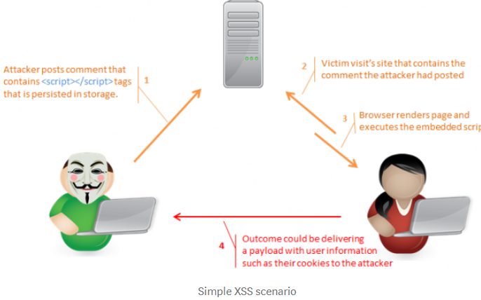
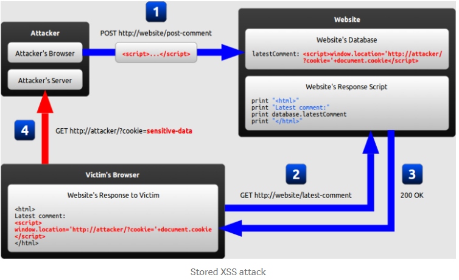
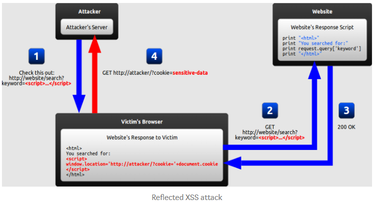
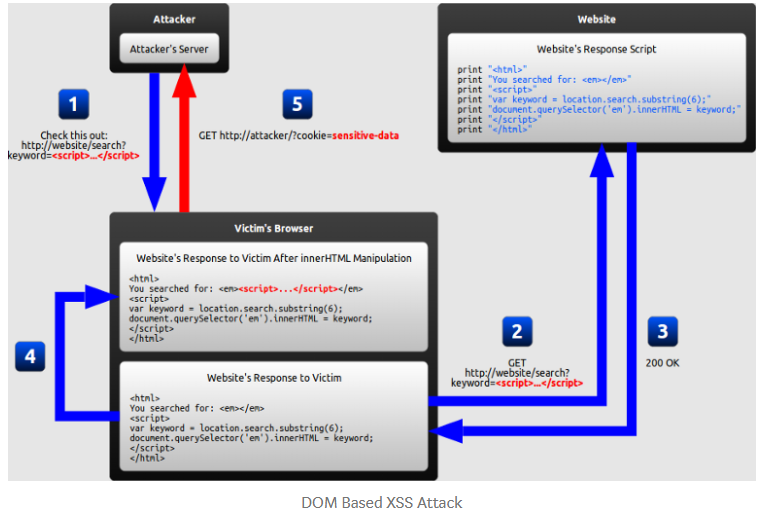

# Introduction

- Cross-site scripting attacks are those in which attackers inject malicious code, usually client-side scripts, into web applications. Because of the number of possible injection locations and techniques, many applications are vulnerable to this attack method. These kind of attacks differ from another web application vulnerabilities because they attack an application’s users, not an application’s infrastructure, but they can still cause a great deal of damage. XSS attacks involve three parties as follows.
  1. The attacker
  2. The victim
  3. The vulnerable web site that the attacker exploits to take action on the victim.
- Out of the three parties, the victim is the only one who actually runs the attacker’s code. The website is just a vehicle for an attack and is not typically affected. An XSS attack can be carried out in a number of ways. As an example, the attacker sends the victim a maliciously crafted URL through e-mail or some other medium via web. When the victim opens the URL in a Web browser, the Web site renders the page and the script is executed on the victim’s computer.
  > 
- As we have a brief understanding about XSS, let’s understand types of XSS. The following article will mainly focus on Stored and Reflected XSS.

# Stored XSS Attacks

> 

1. In this step attacker is using a input form in the website to store the malicious link (eg:- in a comment or as a status)
2. Here a user will request the web page which contains the malicious code unknowingly.
3. Server will send the response to the server with the malicious content
4. Uuser’s browser will render that page which will make the malicious content execute. After this execution user becomes a victim of XSS. (The window.location object can be used to get the current page address (URL) and to redirect the browser to a new page.)

- Stored XSS attacks involve an attacker injecting a script that is permanently stored (persisted) on the target application (eg:- database). A classic example is a malicious script inserted by an attacker in a comment field on a blog or in a forum post.When a user opens the affected web page in a browser, the XSS content will be served as part of the web page (just like a normal comment would). This means that the user will unknowingly execute that malicious code and becomes a victim.

# Reflected XSS Attacks

> 

    1. Attacker will craft a URL and will send to the attackers browser. Attacker will usually use social engineering skills to do this.
    2. User will be tricked into clicking that link and will send a HTTP request to the web site.
    3. Then the server will response with the malicious code in the URL
    4. Then as that response get rendered by the browser, it will execute the malicious code too. In this scenario the URL includes the victim’s cookies as a query parameter, which the attacker can extract from the request when it arrives to his server.

- Reflected XSS attacks, occur when a malicious script is reflected off of a web application to the victim’s browser. The script is activated through a link, which sends a request to a website with a vulnerability that enables execution of malicious scripts. To distribute the malicious link, an attacker typically embeds it into an email or third party website (e.g., in a comment section or in social media).
- The basic feature in the above XSS scenarios is that if the text input by the user is reflected back without proper encoding, the browser will interpret the input script as part of the mark up, and execute the code accordingly.

# DOM XSS Attacks

> 

1. The attacker makes a URL containing a malicious string and sends it to the victim.
2. The victim is tricked by the attacker into requesting the URL from the website.
3. The website receives the request, but does not include the malicious string in the response.
4. The victim’s browser executes the legal script inside the response, causing the malicious script to be inserted into the page.
5. The victim’s browser executes the malicious script inserted into the page, sending the victim’s cookies to the attacker’s server.

# What makes DOM-based XSS different

- In the previous examples of stored and reflected XSS attacks, the server inserts the malicious script into the page, which is then sent in a response to the victim. When the victim’s browser receives the response, it assumes the malicious script to be part of the page’s original content and automatically executes it during page load as with any other script. In the example of a DOM-based XSS attack, however, there is no malicious script inserted as part of the page; the only script that is automatically executed during page load is a original part of the page.

# How can we identify XSS vulnerabilities in a web page.

    - Basically we can do a simple black box test with the browser. We can check the XSS vulnerabilities by verifying whether an application or web server will respond to requests containing simple scripts with an HTTP response that could be executed by a browser. The following script is an example for the above scenario

    > 

- If we get the “THIS IS AN XSS VULNERABILITY” pop up after we passed it through the URL, that site has the vulnerability.
- XSS flaws can be difficult to identify and remove from a web application. There are two main reasons for being an XSS vulnerable site.
  - Input coming into the web applications is not validated
  - Output to the browser is not HTML encoded
- The simplest way to find flaws is to perform a security review of the code and search for all places where input from an HTTP request could possibly make its way into the HTML output. But this can be time consuming if done manually. There are several tools to do these processes. A number of commercial scanners such as Sanctum’s AppScan, Rapid7’s NeXpos, and WhiteHat will automate the process. After identifying the XSS vulnerabilities in a web site then we can identify ways to prevent those attacks.

# Preventing XSS attacks.

1. Validating the input that arrives at the application :- All the data that comes to the web application from a user or from an outside application must be validated. This is the most basic prevention method.
2. Encoding the HTML before sending to the browser :- To help prevent XSS attacks, an application needs to ensure that all variable output in a page is encoded before being returned to the end user.
