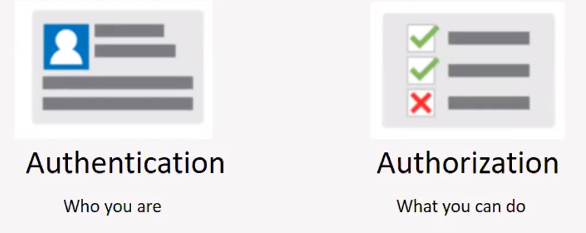
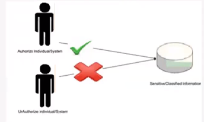
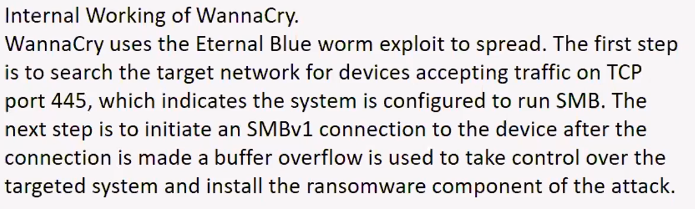

# Security Goals and Its Implementation

> Authentication :- It is the process of giving individuals access to system objects based on their indentity. Prove that you are the right person.

- eg. User id,password, secret question -> something you know
- eg. multi-factor authentication, pin,token -> something you have
- eg. biometric, face, finger print

> Authorization:- It is the function of specifying access rights/privilages to resources.

- The activity you can carry out inside the system once you prove who you are.
- Not giving the complicated access / conflit access.
- It is letting you access what you are suppose to access.
  - A HR data should not be accessed by a salesperson or a salesperson data should not be accessed by administrator.
  - HR job is to increase salary, but HR shoulnot give the access to increase its own salary.

> 

> Confidentiality:- It refers to protecting information from being accessed by unauthorized parties.

> Should not be available for everybody.

> 

> Accountability:- It means that every individual who works with a system should have specific responsibilities for information assurance.

    > NON-REPUDIATION ->> It is the assurance that someonw cannot deny the validity of something.

- Identify each user uniquely.
- There should not be sharing username and passwords.

# How to design a secure system.

> ## Design a Security System.

- Handle external attacks.
- Handle internal errors securely.
- Security in Software Requirements
- Robust, consistent error handling
- Share reqs w/ QA tema
- Use of "defensive programming"
- Validation and Fraud check
- "Security or Bust" Policy
- Use HTTPs

- ## Understading Threats:- stride

  > s -> spoofing -> It refers to the act of posing as someone else or claiming a false identity.

  > t -> Tampering -> It refers to malicious modification of data or processes.

  > r -> Repudiation -> It refers to the ability of denying that an action or an event has occurred.

  > i -> Information Disclosure -> It refers to data leaks or data breaches.

  > d -> Denial of Service -> It refers to causing a service or a network resource to be unavailable to its intended users.

  > e -> Elevation of Privileges -> It refers to gaining access that one should not have.

  | Application Type    | Most Significant Threat>     |
  | ------------------- | ---------------------------- |
  | White House website | Defacement                   |
  | E Commerce          | Denial of Service/compromise |
  | Military            | Infiltration                 |

# Buffer overflow and its vulnerablities

- A buffer overflow, or buffer overrun, is a common software coding mistake that an attacker could exploit to gain access to your system.

  - Due to bad coding practice.
  - declare size of password to low and user enter more than defined size.

  > 

  > 
