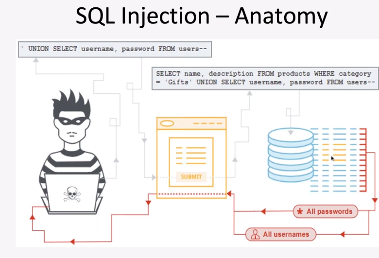
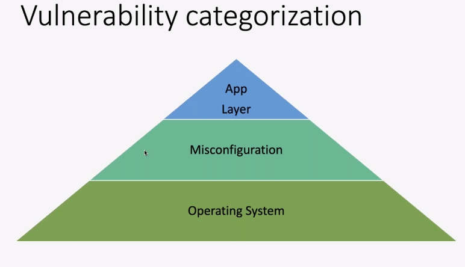
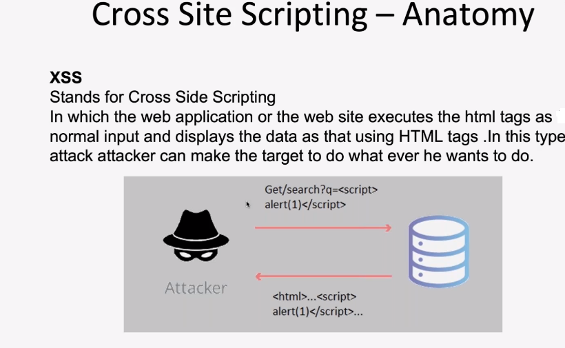

# Security Threats

> Worms and Malware - how they work?

- Difference between worms/malware/torjans

  - Virus -> used to insure self replicate inself and embebded into a file/attachment.
  - Worm -> When connected to a network it get spread to the local network.

- Types of viruses:-
  - Spyware -> sit on machine and undetectable, and listen your activity and sent information to hacker.
  - Ransomware -> hacker encrypt your data and ask for money to decrypt.
  - Adware -> Ads poping up anytime.
  - Worms
  - Malware -> Malicious Software / program
  - Trojans -> try to appear as something and do something in background.
- How virus/worms/malware works?

> What is Threats?

- Circumstances or events that have the potential to cause harm based on the outcome. Threats cause increased concern when more that one vulnerability is leveraged to access system infrastructure.
- They include.
  - Social Engineering/Phishing Attacks -> Fake link, email, download virus
  - DDos attacks -> distributed denial-of-service -> malicious attempt to disrupt normal traffic to a web property.
  - Dos -> Denial of service ->
  - Trojan Installation -> steal data,keyboard, contact
  - Spyware -> spy your activity
  - Worms/Malware ->
  - Organized Crime ->
  - Natural Disasters -> Fire,Flood,EarthQuake

# Vulnerabilities

> What are Vulnerabilities?

- These are essentially weaknesses in a system. They make threats all the more dangerous. This also relates in security programs that can be exploited.

- They include:-
  - SQL injection
  - Cross site Scripting (XSS) -> js code to steal session
  - Broken Authentication
  - Server Misconfiguration -> default password(admin)
  - Cross site Request Forgery (XSRF)
  - Command injection
  - Unrestricted File Uploads

- Types of SQL injection.

  - Bypass Authentication injection.
  - Union based injection aka Advance SQL.
  - ERROR BASED SQL injection.
  - Blind SQL injection.

- How to prevent SQL injection
  - Black Listing
  - White Listing
  - Prepared Statements
  - Hardening DB and OS

# Password Security

> Securing Password Technique:

    - Hashing
    - Salting

> Password based Attacks.

    - Offline dictionary attack
    - Online dictionary attack

> Additional Password Securing Technique:

    - Filtering
    - Honeypots
    - One Time Password
    - Image authentication
